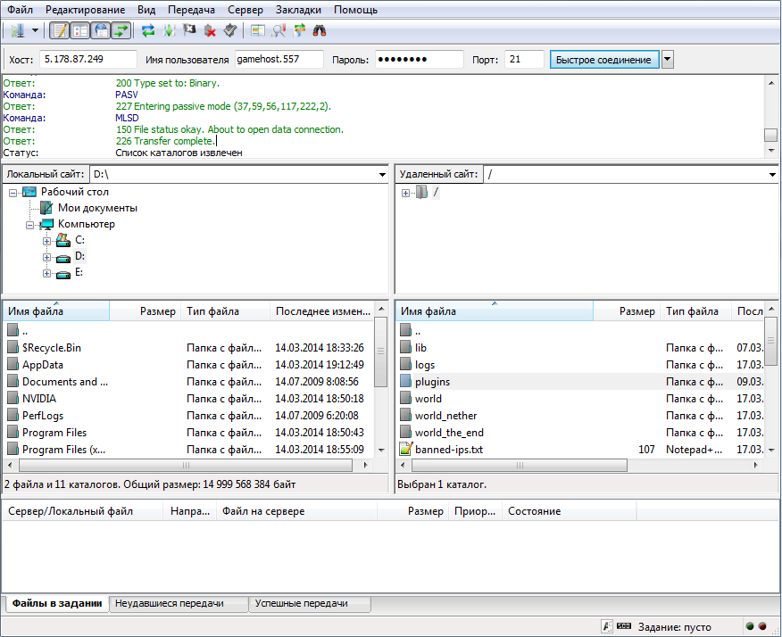
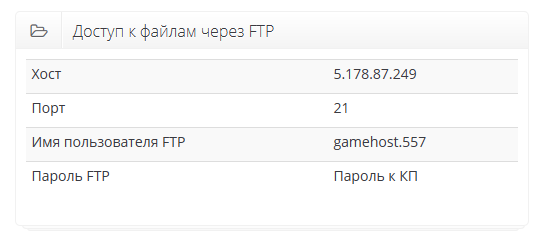

Подключение к серверу через FTP
===============================
В настоящее время, самым правильным и удобным способом работы с файлами является обмен ими по протоколу FTP. Это общепринятный стандарт, широко используется буквально во всём.

Клиентов для FTP существует великое множество, мы рекомендуем использовать `FileZilla <http://filezilla.ru/get/>`_ по причине того, что он прост, но при этом гибок, к тому же он есть на всех популярных операционных системах.

Узнать данные к подключению можно в панели управления: на странице управления вашим сервером, будут указаны данные, которые могут использоваться Вами для захода на сервер по FTP. Вот **пример** как может выглядеть выглядит данный диалог:

Ваш пароль для доступа к фтп — это ваш пароль от панели управления.

Ниже приведен **пример** заполнения данных в FileZilla для подключения к серверу, после нажмите кнопку "**Быстрое соединение**"
Вы успешно подключились к своему серверу, можете начинать загружать файлы и проводить нужные операции.

Если у вас возникают какие либо ошибки или вопросы связанные с подключением к серверу посредством FTP клиента - обращайтесь в техническую поддержку через `тикет систему <https://gamehost.abcd.bz/billing/submitticket.php?step=2&deptid=1/>`_, мы с радостью вам поможем :)
